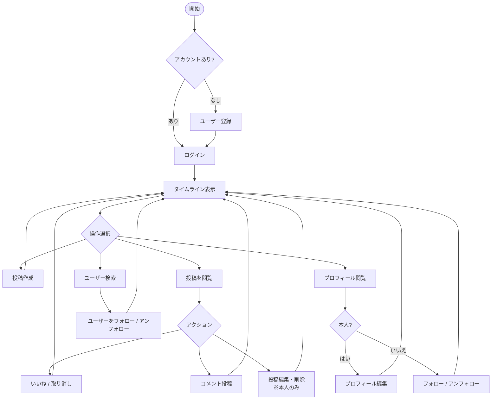
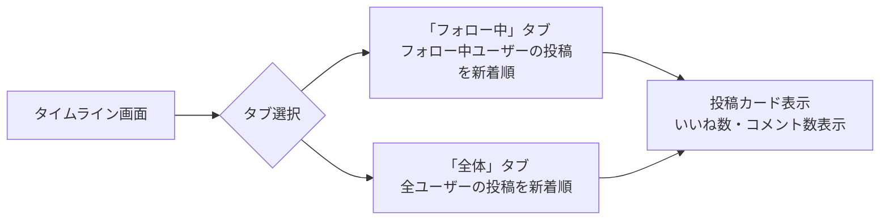
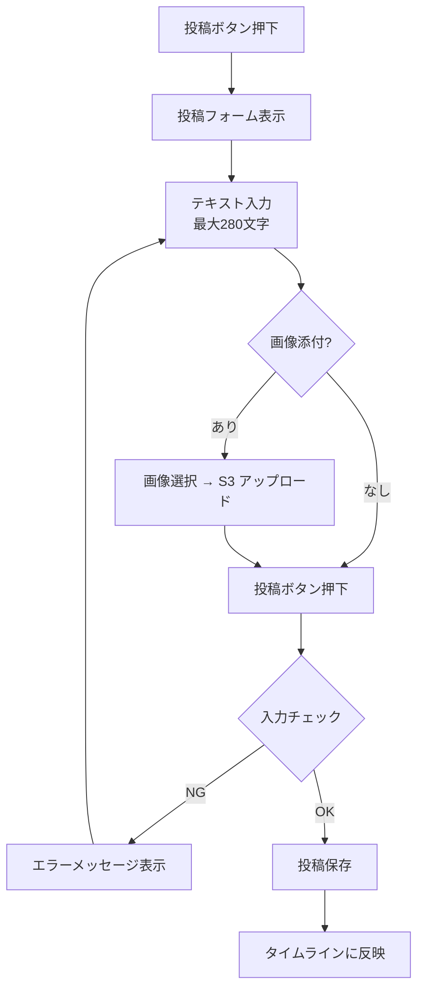
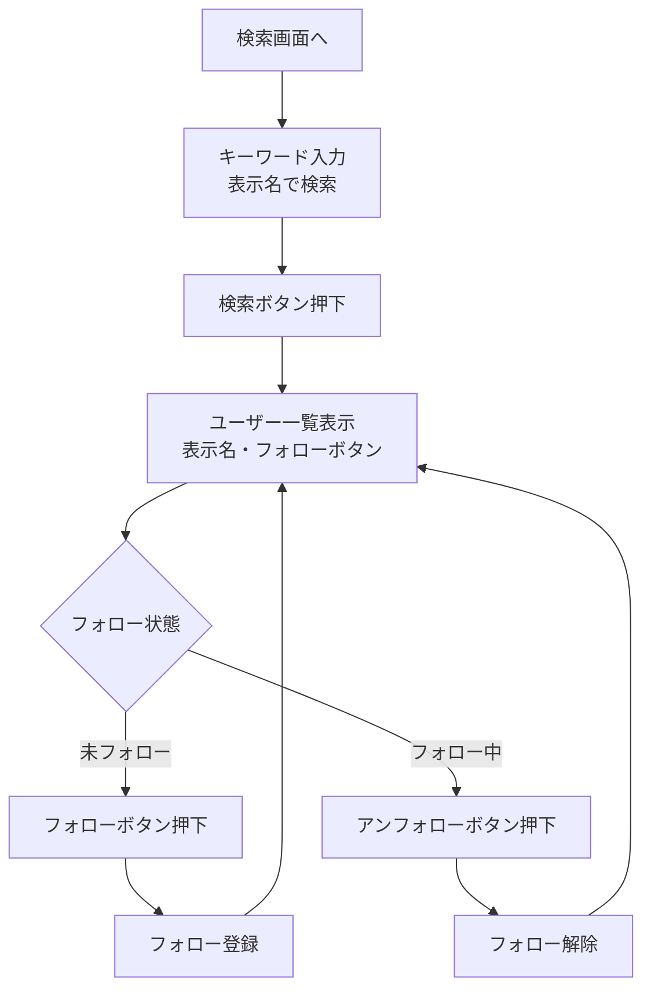

# 業務フロー

[← 要件定義書に戻る](../requirements.md)

---

## 1. メイン業務サイクル

```mermaid
flowchart TD
    A([開始]) --> B{アカウントあり?}
    B -- なし --> C[ユーザー登録]
    B -- あり --> D[ログイン]
    C --> D
    D --> E[タイムライン表示]
    E --> F{操作選択}
    F --> G[投稿作成]
    F --> H[投稿を閲覧]
    F --> I[ユーザー検索]
    F --> J[プロフィール閲覧]
    G --> E
    H --> K{アクション}
    K --> L[いいね / 取り消し]
    K --> M[コメント投稿]
    K --> N[投稿編集・削除\n※本人のみ]
    L --> E
    M --> E
    N --> E
    I --> O[ユーザーをフォロー / アンフォロー]
    O --> E
    J --> P{本人?}
    P -- はい --> Q[プロフィール編集]
    P -- いいえ --> R[フォロー / アンフォロー]
    Q --> E
    R --> E
```

---

## 2. タイムライン切り替えフロー

```mermaid
flowchart LR
    A[タイムライン画面] --> B{タブ選択}
    B --> C["「フォロー中」タブ\nフォロー中ユーザーの投稿を新着順"]
    B --> D["「全体」タブ\n全ユーザーの投稿を新着順"]
    C --> E[投稿カード表示\nいいね数・コメント数表示]
    D --> E
```

---

## 3. 投稿フロー

```mermaid
flowchart TD
    A[投稿ボタン押下] --> B[投稿フォーム表示]
    B --> C[テキスト入力\n最大280文字]
    C --> D{画像添付?}
    D -- あり --> E[画像選択 → S3 アップロード]
    D -- なし --> F[投稿ボタン押下]
    E --> F
    F --> G{入力チェック}
    G -- NG --> H[エラーメッセージ表示]
    H --> C
    G -- OK --> I[投稿保存]
    I --> J[タイムラインに反映]
```

---

## 4. フォロー・ユーザー検索フロー

```mermaid
flowchart TD
    A[検索画面へ] --> B[キーワード入力\n表示名で検索]
    B --> C[検索ボタン押下]
    C --> D[ユーザー一覧表示\n表示名・フォローボタン]
    D --> E{フォロー状態}
    E -- 未フォロー --> F[フォローボタン押下]
    E -- フォロー中 --> G[アンフォローボタン押下]
    F --> H[フォロー登録]
    G --> I[フォロー解除]
    H --> D
    I --> D
```
