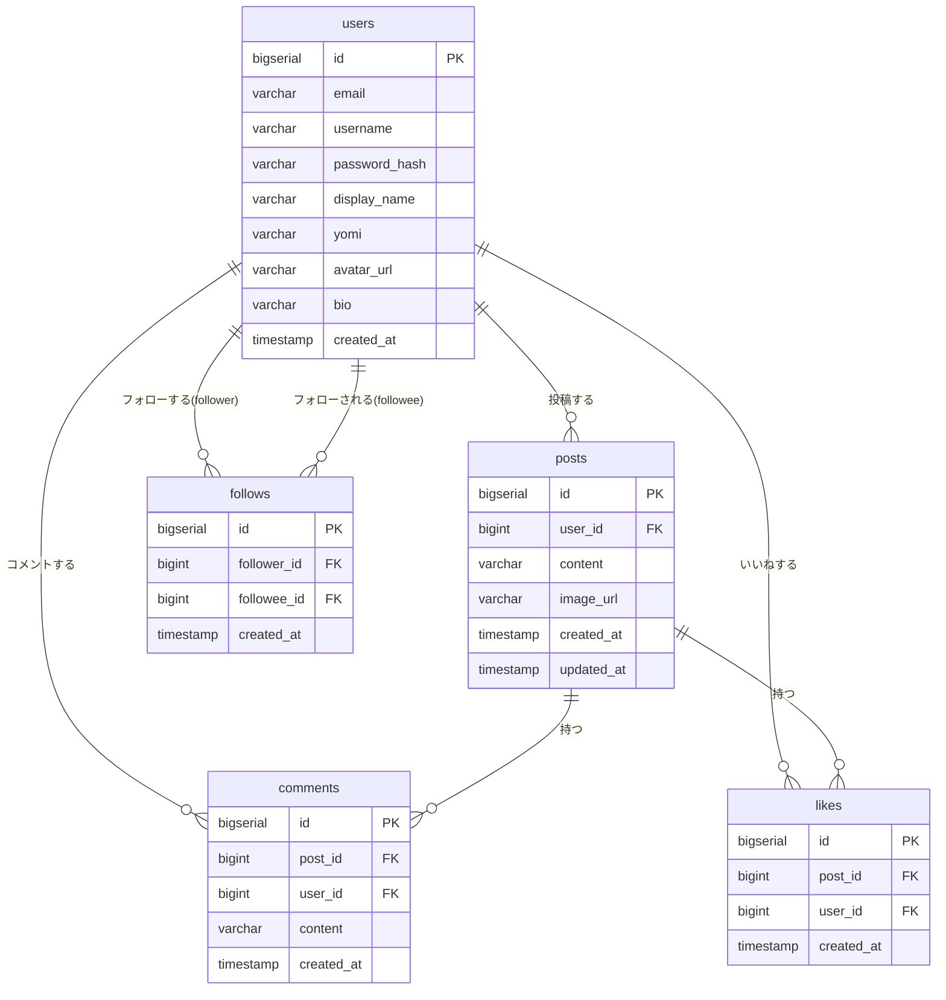

# データモデル

[← 要件定義書に戻る](../requirements.md)

---

## 1. ER 図

---

## 2. テーブル定義

### users（ユーザー）

| カラム名 | 型 | 必須 | 備考 |
| --- | --- | --- | --- |
| id | BIGSERIAL | ○ | PK |
| email | VARCHAR(255) | ○ | UNIQUE。ログインに使用 |
| username | VARCHAR(50) | ○ | UNIQUE。英数字・アンダースコアのみ |
| password_hash | VARCHAR(255) | ○ | BCrypt によるハッシュ |
| display_name | VARCHAR(50) | ○ | 表示名 |
| yomi | VARCHAR(100) | — | 読み仮名（検索用）。ひらがな推奨 |
| avatar_url | VARCHAR(512) | — | S3 の URL。未設定時はデフォルト画像 |
| bio | VARCHAR(160) | — | 自己紹介文 |
| created_at | TIMESTAMP | ○ | 登録日時 |

### posts（投稿）

| カラム名 | 型 | 必須 | 備考 |
| --- | --- | --- | --- |
| id | BIGSERIAL | ○ | PK |
| user_id | BIGINT | ○ | FK → users.id |
| content | VARCHAR(280) | ○ | 投稿本文 |
| image_url | VARCHAR(512) | — | S3 の URL（任意） |
| created_at | TIMESTAMP | ○ | 投稿日時 |
| updated_at | TIMESTAMP | — | 編集日時（編集時に更新） |

### comments（コメント）

| カラム名 | 型 | 必須 | 備考 |
| --- | --- | --- | --- |
| id | BIGSERIAL | ○ | PK |
| post_id | BIGINT | ○ | FK → posts.id |
| user_id | BIGINT | ○ | FK → users.id |
| content | VARCHAR(280) | ○ | コメント本文 |
| created_at | TIMESTAMP | ○ | 投稿日時 |

### likes（いいね）

| カラム名 | 型 | 必須 | 備考 |
| --- | --- | --- | --- |
| id | BIGSERIAL | ○ | PK |
| post_id | BIGINT | ○ | FK → posts.id |
| user_id | BIGINT | ○ | FK → users.id |
| created_at | TIMESTAMP | ○ | いいね日時 |

※ `(post_id, user_id)` に UNIQUE 制約を付与し、重複いいねを防止する。

### follows（フォロー）

| カラム名 | 型 | 必須 | 備考 |
| --- | --- | --- | --- |
| id | BIGSERIAL | ○ | PK |
| follower_id | BIGINT | ○ | FK → users.id（フォローする側） |
| followee_id | BIGINT | ○ | FK → users.id（フォローされる側） |
| created_at | TIMESTAMP | ○ | フォロー日時 |

※ `(follower_id, followee_id)` に UNIQUE 制約を付与し、重複フォローを防止する。
※ `follower_id = followee_id` となるセルフフォローはアプリケーション層で禁止する。
