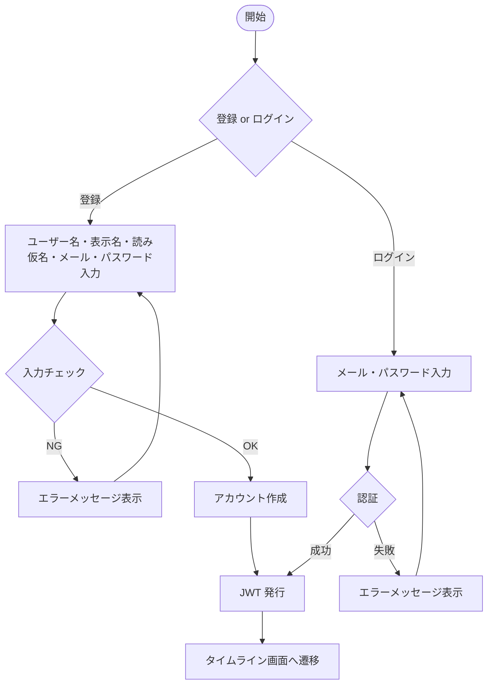

# F-01 / F-02 認証（ユーザー登録・ログイン／ログアウト）

[← 要件定義書に戻る](../../requirements.md)

---

## 1. 概要

メールアドレスとパスワードによるユーザー登録・ログイン・ログアウト機能。
認証には JWT（JSON Web Token）を使用する。

---

## 2. 対象画面

| 画面 ID | 画面名 |
| --- | --- |
| S-01 | ログイン画面 |
| S-02 | ユーザー登録画面 |

---

## 3. 業務フロー

---

## 4. ユースケース

詳細は [use-cases.md](../use-cases.md) の UC-01・UC-02 を参照。

---

## 5. IPO（入力・処理・出力）

### F-01 ユーザー登録

| 項目 | 内容 |
| --- | --- |
| 入力 | ユーザー名・表示名・読み仮名（任意）・メールアドレス・パスワード |
| 処理 | 入力チェック → パスワードを BCrypt でハッシュ化 → DB に保存 → JWT 発行 |
| 出力 | JWT トークン / エラーメッセージ |

### F-02 ログイン

| 項目 | 内容 |
| --- | --- |
| 入力 | メールアドレス・パスワード |
| 処理 | メールアドレスで users テーブルを検索 → BCrypt でパスワード照合 → JWT 発行 |
| 出力 | JWT トークン / エラーメッセージ |

### F-02 ログアウト

| 項目 | 内容 |
| --- | --- |
| 入力 | なし（フロントエンド側でトークンを破棄） |
| 処理 | ローカルストレージから JWT トークンを削除 |
| 出力 | ログイン画面へ遷移 |

---

## 6. 入力チェック仕様

| 項目 | 必須 | 形式・制約 | エラーメッセージ |
| --- | --- | --- | --- |
| ユーザー名 | ○ | 3〜50文字・英数字とアンダースコアのみ・重複不可 | 「ユーザー名は3〜50文字の英数字・アンダースコアで入力してください」 |
| 表示名 | ○ | 1〜50文字・重複不可 | 「表示名は1〜50文字で入力してください」 |
| 読み仮名 | — | 100文字以内 | 「読み仮名は100文字以内で入力してください」 |
| メールアドレス | ○ | メール形式（RFC 5322） | 「有効なメールアドレスを入力してください」 |
| メールアドレス | ○ | 他ユーザーと重複不可 | 「このメールアドレスは既に使用されています」 |
| パスワード | ○ | 8〜64文字・英字と数字を両方含む | 「パスワードは8〜64文字で入力してください」 |

---

## 7. エラーメッセージ

| コード | メッセージ | 発生条件 | 重要度 |
| --- | --- | --- | --- |
| E-001 | 表示名は1〜50文字で入力してください | 表示名が空または50文字超 | E |
| E-002 | 有効なメールアドレスを入力してください | メール形式が不正 | E |
| E-003 | このメールアドレスは既に使用されています | 登録済みメール | E |
| E-004 | パスワードは8文字以上で入力してください | パスワードが8文字未満 | E |
| E-005 | メールアドレスまたはパスワードが正しくありません | 認証失敗 | E |
| E-006 | ユーザー名は3〜50文字の英数字・アンダースコアで入力してください | ユーザー名が不正な形式 | E |
| E-007 | このユーザー名は既に使用されています | ユーザー名重複 | E |
| E-008 | この表示名は既に使用されています | 表示名重複 | E |
| E-009 | 読み仮名は100文字以内で入力してください | 読み仮名が100文字超 | E |

---

## 8. API エンドポイント

| メソッド | パス | 説明 |
| --- | --- | --- |
| POST | `/api/auth/register` | ユーザー登録 |
| POST | `/api/auth/login` | ログイン |

---

## 9. データ設計（関連テーブル）

**users テーブル**（参照: [data-model.md](../data-model.md)）

| カラム | 登録時に使用 |
| --- | --- |
| email | ○ |
| username | ○ |
| password_hash | ○（BCrypt） |
| display_name | ○ |
| yomi | —（任意） |
| created_at | ○（自動） |
