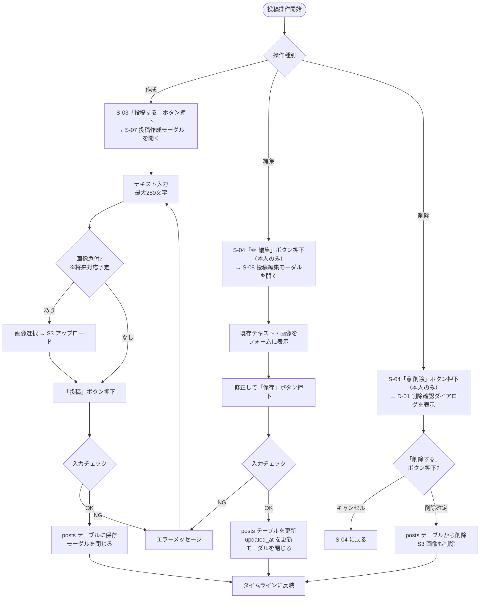

# F-03 投稿（作成・編集・削除）

[← 要件定義書に戻る](../../requirements.md)

---

## 1. 概要

ログインユーザーがテキスト（280文字以内）を投稿できる。
投稿の編集・削除は投稿者本人のみ可能。

> **実装状況（2026-06-27 時点）：** テキスト投稿・編集・削除を実装済み。画像添付（AWS S3）は将来対応予定。

---

## 2. 対象画面

| 画面 ID | 画面名 |
| --- | --- |
| S-03 | タイムライン画面（「投稿する」ボタンから S-07 を呼び出し） |
| S-04 | 投稿詳細・コメント画面（「編集」ボタンから S-08、「削除」ボタンから D-01 を呼び出し） |
| S-07 | 投稿作成モーダル |
| S-08 | 投稿編集モーダル |
| D-01 | 削除確認ダイアログ（投稿削除） |

---

## 3. 業務フロー

---

## 4. ユースケース

詳細は [use-cases.md](../use-cases.md) の UC-03 を参照。

---

## 5. IPO

### 投稿作成

| 項目 | 内容 |
| --- | --- |
| 入力 | テキスト（必須）・画像ファイル（任意、※将来対応予定） |
| 処理 | 入力チェック → posts テーブルに保存（画像 S3 アップロードは将来対応） |
| 出力 | 作成した投稿オブジェクト / エラーメッセージ |

### 投稿編集

| 項目 | 内容 |
| --- | --- |
| 入力 | テキスト（必須）・投稿 ID |
| 処理 | 本人確認 → 入力チェック → posts テーブル更新（updated_at 自動更新） |
| 出力 | 更新した投稿オブジェクト / エラーメッセージ |

### 投稿削除

| 項目 | 内容 |
| --- | --- |
| 入力 | 投稿 ID |
| 処理 | 本人確認 → posts テーブルから削除 |
| 出力 | 204 No Content / エラーメッセージ |

---

## 6. 入力チェック仕様

| 項目 | 必須 | 形式・制約 | エラーメッセージ |
| --- | --- | --- | --- |
| テキスト | ○ | 1〜280文字 | 「投稿テキストは1〜280文字で入力してください」 |
| 画像 | — | JPEG / PNG / GIF。5MB 以内（※将来対応予定） | 「画像は JPEG・PNG・GIF 形式、5MB 以内でアップロードしてください」 |

---

## 7. エラーメッセージ

| コード | メッセージ | 発生条件 | 重要度 |
| --- | --- | --- | --- |
| E-010 | 投稿テキストは1〜280文字で入力してください | テキストが空または281文字以上 | E |
| E-011 | 画像は JPEG・PNG・GIF 形式、5MB 以内でアップロードしてください | 不正な画像形式またはサイズ超過（※将来対応予定） | E |
| E-012 | この投稿を操作する権限がありません | 他ユーザーの投稿を編集・削除しようとした | E |
| E-013 | 投稿が見つかりません | 存在しない投稿 ID を指定 | E |

---

## 8. API エンドポイント

| メソッド | パス | 説明 |
| --- | --- | --- |
| POST | `/api/posts` | 投稿作成（JSON） |
| GET | `/api/posts/{id}` | 投稿詳細取得 |
| PATCH | `/api/posts/{id}` | 投稿編集（本人のみ） |
| DELETE | `/api/posts/{id}` | 投稿削除（本人のみ） |

---

## 9. データ設計（関連テーブル）

**posts テーブル**（参照: [data-model.md](../data-model.md)）

| カラム | 作成 | 編集 | 削除 |
| --- | --- | --- | --- |
| id | 自動 | — | 検索条件 |
| user_id | ログインユーザー ID | — | — |
| content | ○ | ○ | — |
| image_url | S3 URL（任意）※将来対応 | S3 URL（任意）※将来対応 | S3 削除 ※将来対応 |
| created_at | 自動 | — | — |
| updated_at | — | 自動更新 | — |
