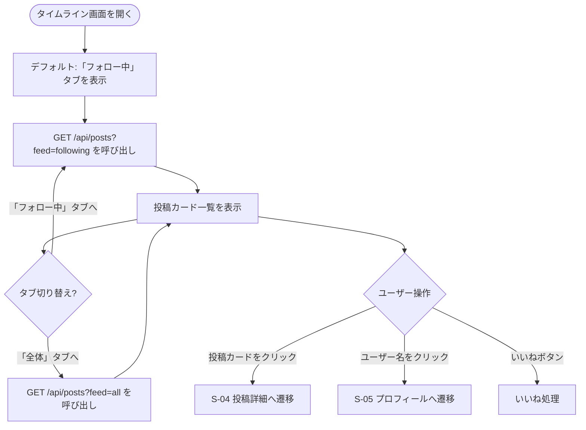

# F-04 タイムライン表示

[← 要件定義書に戻る](../../requirements.md)

---

## 1. 概要

タブ切り替えで「フォロー中」と「全体」の2種類のタイムラインを表示する。
投稿は新着順（created_at 降順）で表示し、各投稿にいいね数・コメント数・投稿者情報を表示する。

---

## 2. 対象画面

| 画面 ID | 画面名 |
| --- | --- |
| S-03 | タイムライン画面 |

---

## 3. 業務フロー

---

## 4. ユースケース

詳細は [use-cases.md](../use-cases.md) の UC-04 を参照。

---

## 5. IPO

### タブ1「フォロー中」

| 項目 | 内容 |
| --- | --- |
| 入力 | ログインユーザーの ID |
| 処理 | follows テーブルで自分がフォローしているユーザーを取得 → その users_id に紐づく posts を created_at 降順で取得 |
| 出力 | 投稿一覧（投稿内容・いいね数・コメント数・投稿者情報） |

### タブ2「全体」

| 項目 | 内容 |
| --- | --- |
| 入力 | なし |
| 処理 | posts テーブルを created_at 降順で全件取得（ページネーション） |
| 出力 | 投稿一覧（投稿内容・いいね数・コメント数・投稿者情報） |

---

## 6. 投稿カードの表示項目

| 項目 | 内容 |
| --- | --- |
| 投稿者アイコン | avatar_url（未設定はデフォルト画像） |
| 投稿者名 | display_name（クリックでプロフィール画面へ） |
| 投稿日時 | created_at（相対表示：「3分前」など） |
| 投稿テキスト | content |
| 投稿画像 | image_url（任意） |
| いいね数 | likes テーブルの件数 |
| コメント数 | comments テーブルの件数 |
| いいねボタン | 自分がいいね済みか否かで表示切り替え |

---

## 7. API エンドポイント

| メソッド | パス | 説明 |
| --- | --- | --- |
| GET | `/api/posts?feed=following&page=0&size=20` | フォロー中タイムライン取得 |
| GET | `/api/posts?feed=all&page=0&size=20` | 全体タイムライン取得 |

---

## 8. データ設計（関連テーブル）

| テーブル | 役割 |
| --- | --- |
| posts | 投稿データの取得元 |
| users | 投稿者情報（display_name・avatar_url） |
| likes | いいね数のカウント・自分がいいね済みかのフラグ |
| comments | コメント数のカウント |
| follows | 「フォロー中」タブ絞り込みに使用 |
