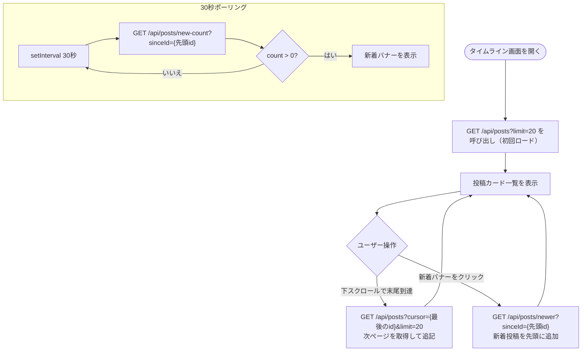

# F-04 タイムライン表示

[← 要件定義書に戻る](../../requirements.md)

---

## 1. 概要

投稿を新着順（id 降順）でカーソルベースの無限スクロール（1ページ20件）で表示する。
30秒ごとに新着件数をポーリングし、新着がある場合はバナーを表示してクリックで反映する（X/Twitter方式）。

> **実装状況（2026-06-27 時点）：** 「全体」タイムラインを実装済み。「フォロー中」タブはフォロー機能と合わせて将来対応予定。いいね数・コメント数表示も将来対応予定。

---

## 2. 対象画面

| 画面 ID | 画面名 |
| --- | --- |
| S-03 | タイムライン画面 |

---

## 3. 業務フロー

---

## 4. ユースケース

詳細は [use-cases.md](../use-cases.md) の UC-04 を参照。

---

## 5. IPO

### 全体タイムライン（実装済み）

| 項目 | 内容 |
| --- | --- |
| 入力 | `cursor`（任意。前ページ最後の投稿 id）、`limit`（取得件数、デフォルト 20） |
| 処理 | posts テーブルを id 降順で取得。cursor 指定時は `id < cursor` の条件を追加 |
| 出力 | 投稿一覧（id・userId・displayName・content・createdAt・updatedAt） |

### 新着件数チェック（30秒ポーリング）

| 項目 | 内容 |
| --- | --- |
| 入力 | `sinceId`（現在先頭の投稿 id） |
| 処理 | `id > sinceId` の posts 件数をカウント |
| 出力 | 新着件数（number） |

### 新着投稿取得（バナークリック時）

| 項目 | 内容 |
| --- | --- |
| 入力 | `sinceId`（現在先頭の投稿 id） |
| 処理 | `id > sinceId` の posts を id 降順で取得 |
| 出力 | 新着投稿一覧 |

### フォロー中タイムライン（将来対応予定）

| 項目 | 内容 |
| --- | --- |
| 入力 | ログインユーザーの ID |
| 処理 | follows テーブルで自分がフォローしているユーザーを取得 → その users_id に紐づく posts を id 降順で取得 |
| 出力 | 投稿一覧 |

---

## 6. 投稿カードの表示項目

| 項目 | 内容 | 実装状況 |
| --- | --- | --- |
| 投稿者アバター | display_name の頭文字をアイコン表示 | ✅ 実装済み |
| 投稿者名 | display_name | ✅ 実装済み |
| 投稿日時 | createdAt（日本語ロケール表示） | ✅ 実装済み |
| 投稿テキスト | content | ✅ 実装済み |
| 編集済みバッジ | updatedAt ≠ createdAt の場合に表示 | ✅ 実装済み |
| 編集・削除ボタン | 自分の投稿のみ表示 | ✅ 実装済み |
| 投稿画像 | image_url（任意） | 将来対応予定 |
| いいね数・ボタン | likes テーブルの件数 | 将来対応予定 |
| コメント数 | comments テーブルの件数 | 将来対応予定 |

---

## 7. API エンドポイント

| メソッド | パス | 説明 | 実装状況 |
| --- | --- | --- | --- |
| GET | `/api/posts?limit=20` | 全体タイムライン取得（初回） | ✅ 実装済み |
| GET | `/api/posts?cursor={id}&limit=20` | 全体タイムライン取得（無限スクロール） | ✅ 実装済み |
| GET | `/api/posts/new-count?sinceId={id}` | 新着件数チェック（30秒ポーリング用） | ✅ 実装済み |
| GET | `/api/posts/newer?sinceId={id}` | 新着投稿取得（バナークリック時） | ✅ 実装済み |
| GET | `/api/posts?feed=following&cursor={id}&limit=20` | フォロー中タイムライン取得 | 将来対応予定 |

---

## 8. データ設計（関連テーブル）

| テーブル | 役割 |
| --- | --- |
| posts | 投稿データの取得元 |
| users | 投稿者情報（display_name・avatar_url） |
| likes | いいね数のカウント・自分がいいね済みかのフラグ |
| comments | コメント数のカウント |
| follows | 「フォロー中」タブ絞り込みに使用（将来対応予定） |
