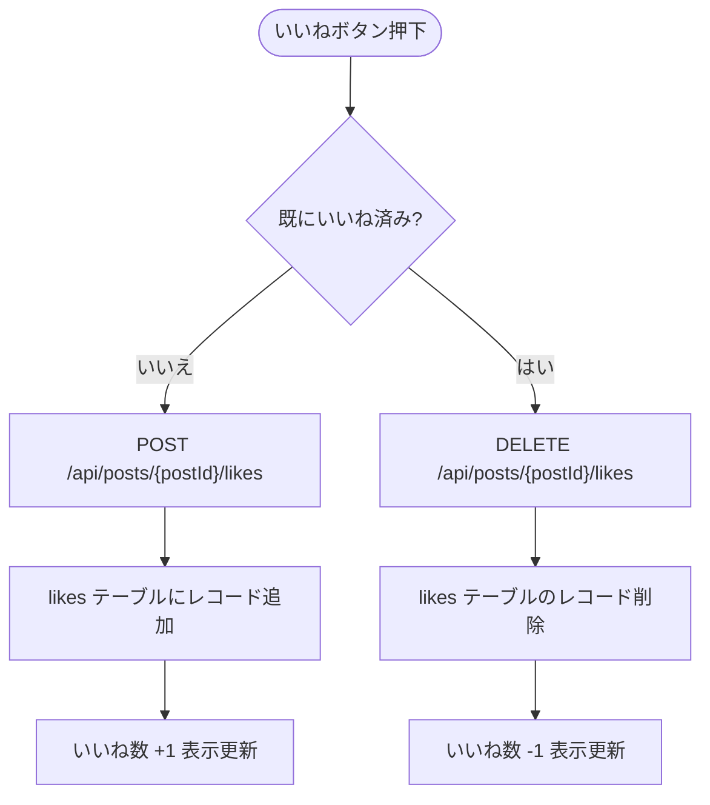

# F-05 いいね

[← 要件定義書に戻る](../../requirements.md)

---

## 1. 概要

投稿に対していいねを付ける・取り消す機能。いいね数はタイムライン・投稿詳細画面に表示する。
同一ユーザーが同一投稿に複数回いいねすることはできない。

---

## 2. 対象画面

| 画面 ID | 画面名 |
| --- | --- |
| S-03 | タイムライン画面 |
| S-04 | 投稿詳細・コメント画面 |

---

## 3. 業務フロー

---

## 4. ユースケース

詳細は [use-cases.md](../use-cases.md) の UC-05 を参照。

---

## 5. IPO

### いいね

| 項目 | 内容 |
| --- | --- |
| 入力 | 投稿 ID・ログインユーザーの ID |
| 処理 | `(post_id, user_id)` の重複チェック → likes テーブルにレコード追加 |
| 出力 | 更新後のいいね数 |

### いいね取り消し

| 項目 | 内容 |
| --- | --- |
| 入力 | 投稿 ID・ログインユーザーの ID |
| 処理 | likes テーブルから `(post_id, user_id)` に一致するレコードを削除 |
| 出力 | 更新後のいいね数 |

---

## 6. エラーメッセージ

| コード | メッセージ | 発生条件 | 重要度 |
| --- | --- | --- | --- |
| E-020 | 既にいいね済みです | 重複いいねリクエスト | E |
| E-021 | いいねが見つかりません | 取り消し対象が存在しない | E |

---

## 7. API エンドポイント

| メソッド | パス | 説明 |
| --- | --- | --- |
| POST | `/api/posts/{postId}/likes` | いいね |
| DELETE | `/api/posts/{postId}/likes` | いいね取り消し |

---

## 8. データ設計（関連テーブル）

**likes テーブル**（参照: [data-model.md](../data-model.md)）

| カラム | 内容 |
| --- | --- |
| post_id | いいね対象の投稿 ID |
| user_id | いいねしたユーザーの ID |
| created_at | いいね日時 |

※ `UNIQUE(post_id, user_id)` により DB レベルでも重複を防止する。
