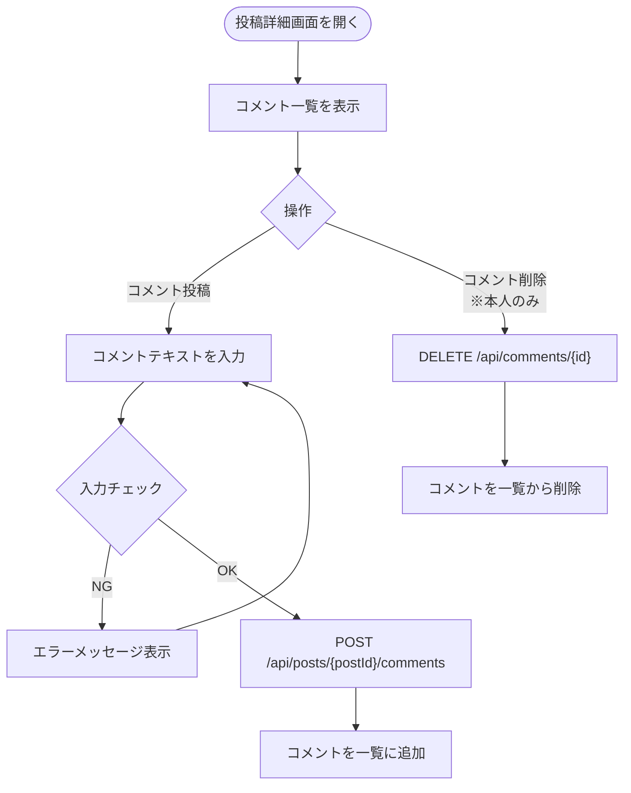

# F-06 コメント

[← 要件定義書に戻る](../../requirements.md)

---

## 1. 概要

投稿に対してコメントを投稿・削除できる機能。コメント数はタイムライン・投稿詳細画面に表示する。
コメントの削除はコメント投稿者本人のみ可能。

---

## 2. 対象画面

| 画面 ID | 画面名 |
| --- | --- |
| S-04 | 投稿詳細・コメント画面 |

---

## 3. 業務フロー

---

## 4. ユースケース

詳細は [use-cases.md](../use-cases.md) の UC-06 を参照。

---

## 5. IPO

### コメント投稿

| 項目 | 内容 |
| --- | --- |
| 入力 | コメントテキスト・投稿 ID・ログインユーザーの ID |
| 処理 | 入力チェック → comments テーブルにレコード追加 |
| 出力 | 作成したコメントオブジェクト |

### コメント削除

| 項目 | 内容 |
| --- | --- |
| 入力 | コメント ID |
| 処理 | 本人確認 → comments テーブルからレコード削除 |
| 出力 | 204 No Content |

---

## 6. 入力チェック仕様

| 項目 | 必須 | 形式・制約 | エラーメッセージ |
| --- | --- | --- | --- |
| コメントテキスト | ○ | 1〜280文字 | 「コメントは1〜280文字で入力してください」 |

---

## 7. エラーメッセージ

| コード | メッセージ | 発生条件 | 重要度 |
| --- | --- | --- | --- |
| E-030 | コメントは1〜280文字で入力してください | テキストが空または281文字以上 | E |
| E-031 | このコメントを削除する権限がありません | 他ユーザーのコメントを削除しようとした | E |
| E-032 | コメントが見つかりません | 存在しないコメント ID を指定 | E |

---

## 8. API エンドポイント

| メソッド | パス | 説明 |
| --- | --- | --- |
| GET | `/api/posts/{postId}/comments` | コメント一覧取得 |
| POST | `/api/posts/{postId}/comments` | コメント投稿 |
| DELETE | `/api/comments/{id}` | コメント削除（本人のみ） |

---

## 9. データ設計（関連テーブル）

**comments テーブル**（参照: [data-model.md](../data-model.md)）

| カラム | 内容 |
| --- | --- |
| post_id | コメント対象の投稿 ID |
| user_id | コメント投稿者の ID |
| content | コメント本文 |
| created_at | 投稿日時 |
