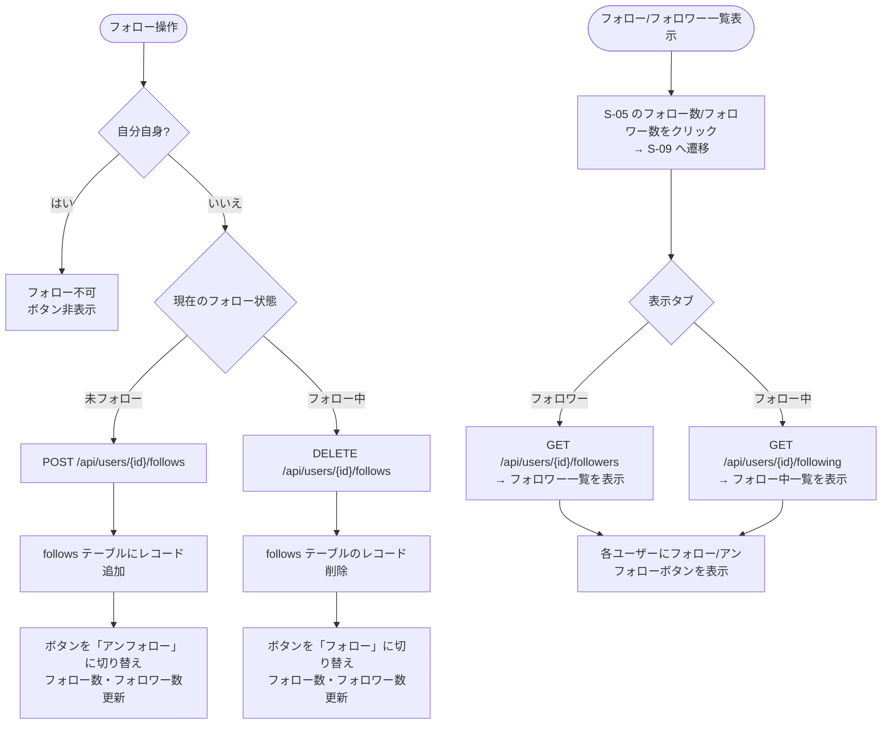

# F-07 フォロー／アンフォロー

[← 要件定義書に戻る](../../requirements.md)

---

## 1. 概要

他ユーザーをフォロー・アンフォローできる機能。
フォロー数・フォロワー数をプロフィール画面に表示する。
自分自身のフォローは禁止する。「フォロー中」タイムラインはフォロー関係に基づいて表示される。

---

## 2. 対象画面

| 画面 ID | 画面名 |
| --- | --- |
| S-05 | プロフィール画面 |
| S-06 | ユーザー検索画面 |
| S-09 | フォロー/フォロワー一覧画面 |

---

## 3. 業務フロー

---

## 4. ユースケース

詳細は [use-cases.md](../use-cases.md) の UC-07 を参照。

---

## 5. IPO

### フォロー

| 項目 | 内容 |
| --- | --- |
| 入力 | フォロー対象ユーザーの ID・ログインユーザーの ID |
| 処理 | 自分自身チェック → 重複チェック → follows テーブルにレコード追加 |
| 出力 | 更新後のフォロー数・フォロワー数 |

### アンフォロー

| 項目 | 内容 |
| --- | --- |
| 入力 | アンフォロー対象ユーザーの ID・ログインユーザーの ID |
| 処理 | follows テーブルから `(follower_id, followee_id)` に一致するレコードを削除 |
| 出力 | 更新後のフォロー数・フォロワー数 |

---

## 6. エラーメッセージ

| コード | メッセージ | 発生条件 | 重要度 |
| --- | --- | --- | --- |
| E-040 | 自分自身をフォローすることはできません | follower_id = followee_id | E |
| E-041 | 既にフォロー済みです | 重複フォローリクエスト | E |
| E-042 | フォローしていません | 未フォローのアンフォローリクエスト | E |

---

## 7. API エンドポイント

| メソッド | パス | 説明 |
| --- | --- | --- |
| POST | `/api/users/{id}/follows` | フォロー |
| DELETE | `/api/users/{id}/follows` | アンフォロー |
| GET | `/api/users/{id}/followers` | フォロワー一覧 |
| GET | `/api/users/{id}/following` | フォロー中一覧 |

---

## 8. データ設計（関連テーブル）

**follows テーブル**（参照: [data-model.md](../data-model.md)）

| カラム | 内容 |
| --- | --- |
| follower_id | フォローする側のユーザー ID |
| followee_id | フォローされる側のユーザー ID |
| created_at | フォロー日時 |

※ `UNIQUE(follower_id, followee_id)` により DB レベルでも重複を防止する。
