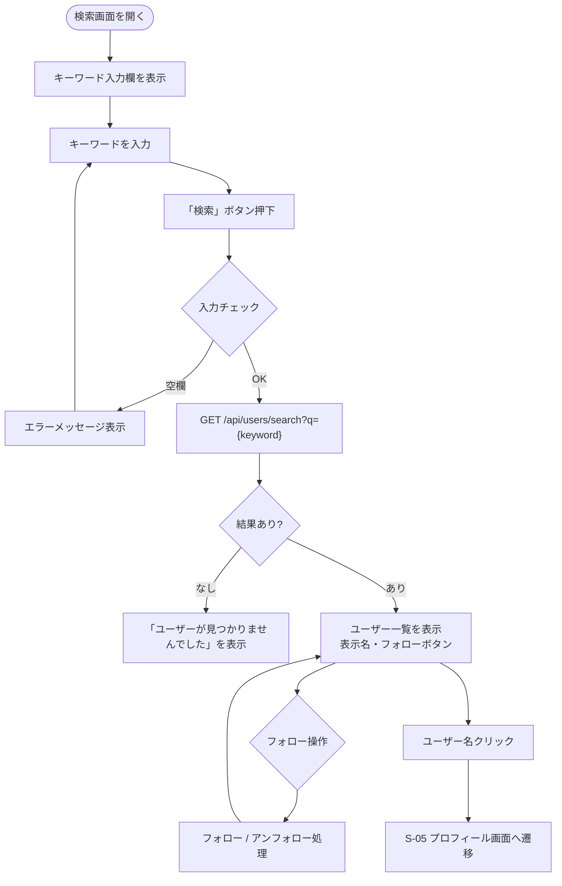

# F-08 ユーザー検索

[← 要件定義書に戻る](../../requirements.md)

---

## 1. 概要

表示名（display_name）の部分一致でユーザーを検索する機能。
検索結果から直接フォロー／アンフォロー操作が可能。
検索は「検索」ボタン押下時に実行する。

---

## 2. 対象画面

| 画面 ID | 画面名 |
| --- | --- |
| S-06 | ユーザー検索画面 |

---

## 3. 業務フロー

---

## 4. ユースケース

詳細は [use-cases.md](../use-cases.md) の UC-08 を参照。

---

## 5. IPO

| 項目 | 内容 |
| --- | --- |
| 入力 | 検索キーワード（表示名の一部） |
| 処理 | users テーブルの display_name に対して LIKE 検索（`%keyword%`）。自分自身は結果から除外。ページネーション（1ページ20件） |
| 出力 | ユーザー一覧（display_name・フォロー中フラグ） |

---

## 6. 入力チェック仕様

| 項目 | 必須 | 形式・制約 | エラーメッセージ |
| --- | --- | --- | --- |
| キーワード | ○ | 1文字以上 | 「検索キーワードを入力してください」 |

---

## 7. エラーメッセージ

| コード | メッセージ | 発生条件 | 重要度 |
| --- | --- | --- | --- |
| E-050 | 検索キーワードを入力してください | キーワードが空 | E |
| I-051 | ユーザーが見つかりませんでした | 検索結果が0件 | I |

---

## 8. API エンドポイント

| メソッド | パス | 説明 |
| --- | --- | --- |
| GET | `/api/users/search?q={keyword}&page=0&size=20` | ユーザー検索（表示名の部分一致） |

---

## 9. データ設計（関連テーブル）

| テーブル | 役割 |
| --- | --- |
| users | display_name で LIKE 検索 |
| follows | 検索結果のユーザーへのフォロー状態（following フラグ）を判定 |
