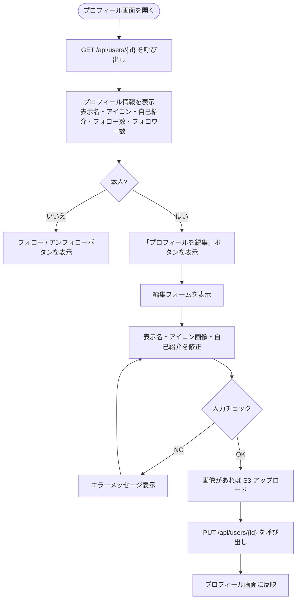

# F-09 プロフィール表示・編集

[← 要件定義書に戻る](../../requirements.md)

---

## 1. 概要

ユーザーのプロフィール（表示名・アイコン画像・自己紹介文）を表示する機能。
本人のみ編集でき、アイコン画像は AWS S3 に保存する。
フォロー数・フォロワー数・投稿一覧もプロフィール画面で確認できる。

---

## 2. 対象画面

| 画面 ID | 画面名 |
| --- | --- |
| S-05 | プロフィール画面 |

---

## 3. 業務フロー

---

## 4. ユースケース

詳細は [use-cases.md](../use-cases.md) の UC-09 を参照。

---

## 5. IPO

### プロフィール表示

| 項目 | 内容 |
| --- | --- |
| 入力 | 対象ユーザーの ID |
| 処理 | users テーブルからユーザー情報を取得。follows テーブルからフォロー数・フォロワー数を集計。posts テーブルから投稿一覧を取得 |
| 出力 | プロフィール情報（表示名・avatar_url・bio・フォロー数・フォロワー数・投稿一覧） |

### プロフィール編集

| 項目 | 内容 |
| --- | --- |
| 入力 | 表示名・アイコン画像ファイル（任意）・自己紹介文（任意） |
| 処理 | 本人確認 → 入力チェック → アイコン画像があれば旧 S3 オブジェクト削除 → S3 へアップロード → users テーブルを更新 |
| 出力 | 更新後のプロフィールオブジェクト / エラーメッセージ |

---

## 6. 入力チェック仕様

| 項目 | 必須 | 形式・制約 | エラーメッセージ |
| --- | --- | --- | --- |
| 表示名 | ○ | 1〜50文字 | 「表示名は1〜50文字で入力してください」 |
| アイコン画像 | — | JPEG / PNG。5MB 以内 | 「画像は JPEG・PNG 形式、5MB 以内でアップロードしてください」 |
| 自己紹介文 | — | 160文字以内 | 「自己紹介文は160文字以内で入力してください」 |

---

## 7. エラーメッセージ

| コード | メッセージ | 発生条件 | 重要度 |
| --- | --- | --- | --- |
| E-060 | 表示名は1〜50文字で入力してください | 表示名が空または50文字超 | E |
| E-061 | 画像は JPEG・PNG 形式、5MB 以内でアップロードしてください | 不正な形式またはサイズ超過 | E |
| E-062 | 自己紹介文は160文字以内で入力してください | bio が160文字超 | E |
| E-063 | このプロフィールを編集する権限がありません | 他ユーザーのプロフィールを編集しようとした | E |

---

## 8. API エンドポイント

| メソッド | パス | 説明 |
| --- | --- | --- |
| GET | `/api/users/{id}` | プロフィール取得 |
| PUT | `/api/users/{id}` | プロフィール編集（本人のみ、multipart/form-data） |
| GET | `/api/users/{id}/posts` | ユーザーの投稿一覧 |
| GET | `/api/users/{id}/followers` | フォロワー一覧 |
| GET | `/api/users/{id}/following` | フォロー中一覧 |

---

## 9. データ設計（関連テーブル）

**users テーブル**（参照: [data-model.md](../data-model.md)）

| カラム | 表示 | 編集 |
| --- | --- | --- |
| display_name | ○ | ○ |
| avatar_url | ○（S3 URL） | ○（S3 アップロード） |
| bio | ○ | ○ |
| created_at | ○ | — |

**関連テーブル**

| テーブル | 役割 |
| --- | --- |
| posts | ユーザーの投稿一覧 |
| follows | フォロー数（followee_id = 自分）・フォロワー数（follower_id = 自分）の集計 |
