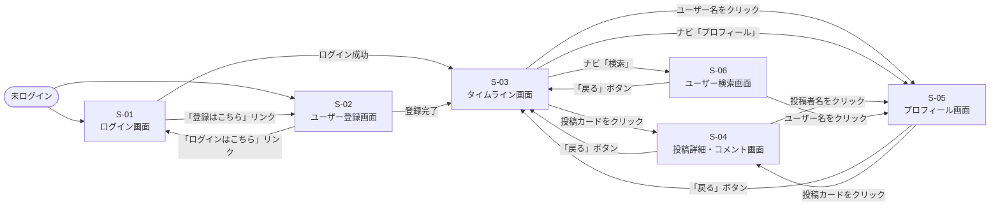
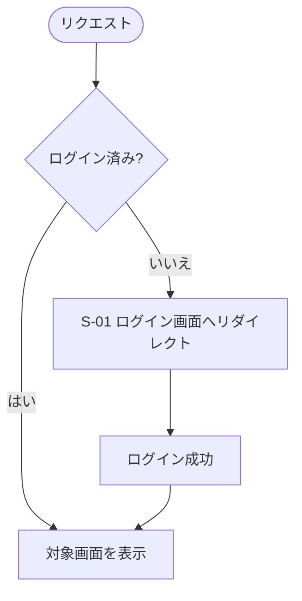

# 画面遷移図

[← 要件定義書に戻る](../requirements.md)

---

## 1. 全体の画面遷移

---

## 2. 認証フロー

---

## 3. 画面一覧

| 画面 ID | 画面名 | 認証必要 | URL | 主な遷移元 |
| --- | --- | --- | --- | --- |
| S-01 | ログイン画面 | 不要 | `/login` | 未ログイン時・ログアウト後 |
| S-02 | ユーザー登録画面 | 不要 | `/register` | S-01 のリンク |
| S-03 | タイムライン画面 | 必要 | `/` | ログイン後・ナビ |
| S-04 | 投稿詳細・コメント画面 | 必要 | `/posts/:id` | S-03 / S-05 の投稿カード |
| S-05 | プロフィール画面 | 必要 | `/users/:id` | ユーザー名クリック・ナビ |
| S-06 | ユーザー検索画面 | 必要 | `/search` | ナビの検索アイコン |
