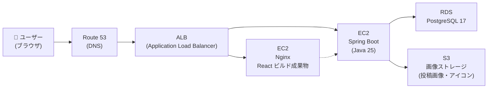
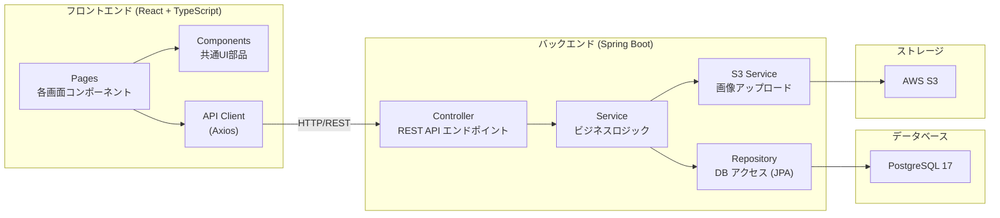
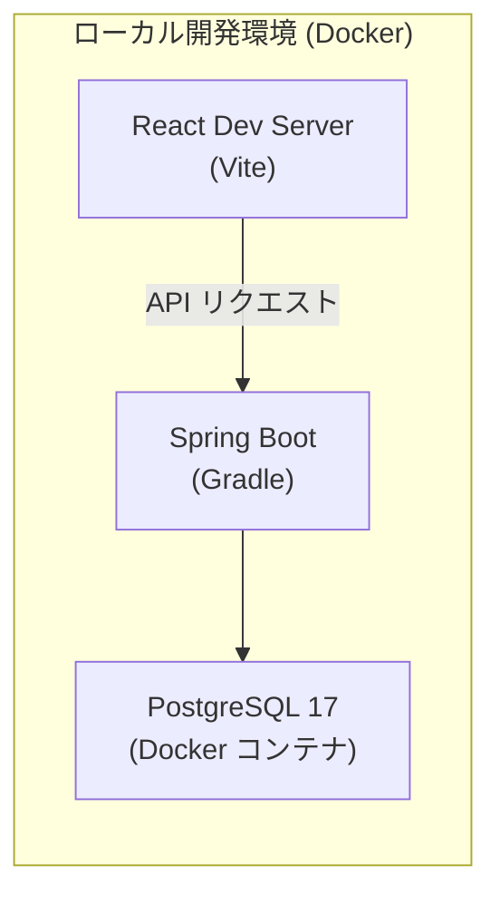

# システム構成図

[← 要件定義書に戻る](../requirements.md)

---

## 1. インフラ構成図

※ EC2 利用については確定前だが、現時点の AWS 構成案として整備する。

---

## 2. アプリケーション構成（3層アーキテクチャ）

---

## 3. 開発環境構成

| 項目 | ローカル環境 | 本番環境（AWS） |
| --- | --- | --- |
| フロントエンド | Vite 開発サーバー | EC2 + Nginx |
| バックエンド | Spring Boot 直接起動 | EC2 |
| DB | Docker（PostgreSQL） | RDS（PostgreSQL） |
| 画像 | ローカルまたは S3 | S3 |
