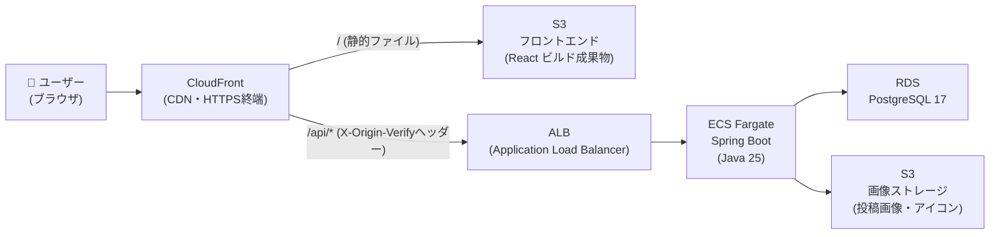
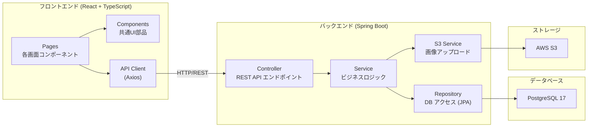
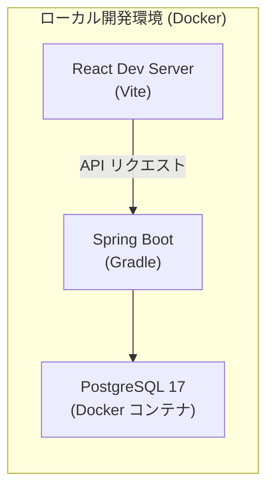

# システム構成図

[← 要件定義書に戻る](../requirements.md)

---

## 1. インフラ構成図

EC2レス構成として `infra/terraform/` にコード実装済み。学習目的のプロジェクトのため、AWS上への実際の構築（`terraform apply`）は必要な時だけ行い、使い終えたら `terraform destroy` で閉じる運用にしている（常時稼働しているわけではない）。詳細は [infra/terraform/README.md](../../infra/terraform/README.md) を参照。

```mermaid
flowchart LR
    User["👤 ユーザー\n(ブラウザ)"]
    CloudFront["CloudFront\n(CDN・HTTPS終端)"]
    S3Frontend["S3\nフロントエンド\n(React ビルド成果物)"]
    ALB["ALB\n(Application Load Balancer)"]
    ECS["ECS Fargate\nSpring Boot\n(Java 25)"]
    RDS["RDS\nPostgreSQL 17"]
    S3Images["S3\n画像ストレージ\n(投稿画像・アイコン)"]

    User --> CloudFront
    CloudFront -- "/ (静的ファイル)" --> S3Frontend
    CloudFront -- "/api/* (X-Origin-Verifyヘッダー)" --> ALB
    ALB --> ECS
    ECS --> RDS
    ECS --> S3Images
```

- ブラウザが直接通信する相手はCloudFrontのみ。フロント（S3）とAPI（ALB）を同一オリジンにまとめることで、Mixed ContentとCookieのSameSite制約を回避している
- ALBへは、CloudFrontが付与する秘密ヘッダー（`X-Origin-Verify`）を持つリクエストのみ到達可能。ALBのDNS名を直接知っていてもアクセスできない
- ALBはHTTPリスナーのみ（独自ドメイン・ACM証明書は未取得のため）。CloudFront〜ALB間の内部区間のみHTTPで、ブラウザとの通信は常にHTTPS
- 学習目的でコスト優先のため、RDS・VPC Interface Endpointはシングルaz構成。ECS Fargateはタスク数を1つ（`desired_count = 1`）に絞ることでコストを抑えている
- 画像ストレージ（S3・上図の`S3Images`）は、ローカルDocker検証時に手動作成した既存バケットをそのまま使っており、**Terraformでは管理していない**（`terraform apply`/`destroy`の対象外。バケット自体のTerraform化は別Issueで対応予定）

---

## 2. アプリケーション構成（3層アーキテクチャ）

```mermaid
flowchart LR
    subgraph Frontend["フロントエンド (React + TypeScript)"]
        Pages["Pages\n各画面コンポーネント"]
        Components["Components\n共通UI部品"]
        API_Client["API Client\n(Axios)"]
    end

    subgraph Backend["バックエンド (Spring Boot)"]
        Controller["Controller\nREST API エンドポイント"]
        Service["Service\nビジネスロジック"]
        Repository["Repository\nDB アクセス (JPA)"]
        S3Service["S3 Service\n画像アップロード"]
    end

    subgraph DB["データベース"]
        PostgreSQL["PostgreSQL 17"]
    end

    subgraph Storage["ストレージ"]
        AmazonS3["AWS S3"]
    end

    Pages --> Components
    Pages --> API_Client
    API_Client -- HTTP/REST --> Controller
    Controller --> Service
    Service --> Repository
    Service --> S3Service
    Repository --> PostgreSQL
    S3Service --> AmazonS3
```

---

## 3. 開発環境構成

```mermaid
flowchart LR
    subgraph Local["ローカル開発環境 (Docker)"]
        FE_Dev["React Dev Server\n(Vite)"]
        BE_Dev["Spring Boot\n(Gradle)"]
        DB_Dev["PostgreSQL 17\n(Docker コンテナ)"]
    end

    FE_Dev -- API リクエスト --> BE_Dev
    BE_Dev --> DB_Dev
```

| 項目 | ローカル環境 | 本番環境（AWS） |
| --- | --- | --- |
| フロントエンド | Vite 開発サーバー | S3 + CloudFront |
| バックエンド | Spring Boot 直接起動 | ECS Fargate |
| DB | Docker（PostgreSQL） | RDS（PostgreSQL） |
| 画像 | ローカルまたは S3 | S3 |
