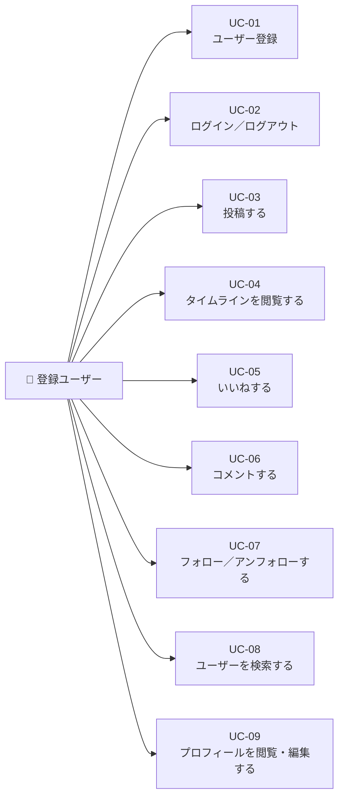

# ユースケース

[← 要件定義書に戻る](../requirements.md)

---

## 1. ユースケース図

---

## 2. ユースケース記述

### UC-01 ユーザー登録

| 項目 | 内容 |
| --- | --- |
| アクター | 未登録ユーザー |
| 概要 | メールアドレス・パスワード・表示名を入力してアカウントを作成する |
| 事前条件 | アカウントを持っていない |
| 事後条件 | アカウントが作成され、ログイン状態になる |

**基本フロー**

1. ユーザーが登録画面を開く
2. メールアドレス・パスワード・表示名を入力する
3. 「登録」ボタンを押す
4. システムが入力値を検証する
5. システムがアカウントを作成し、JWT トークンを発行する
6. タイムライン画面へ遷移する

**代替フロー**

- A1. メールアドレスが既に使用済み → エラーメッセージを表示し、再入力を促す
- A2. 入力値が不正（空・形式違反） → エラーメッセージを表示する

---

### UC-02 ログイン／ログアウト

| 項目 | 内容 |
| --- | --- |
| アクター | 登録ユーザー |
| 概要 | メールアドレスとパスワードで認証し、アプリを利用できる状態にする |
| 事前条件 | アカウントを持っている |
| 事後条件 | ログイン状態になり、タイムライン画面へ遷移する |

**基本フロー**

1. ユーザーがログイン画面を開く
2. メールアドレスとパスワードを入力する
3. 「ログイン」ボタンを押す
4. システムが認証を行い、JWT トークンを発行する
5. タイムライン画面へ遷移する

**代替フロー**

- A1. メールアドレスまたはパスワードが誤り → エラーメッセージを表示する

**ログアウト**

1. ユーザーがログアウトボタンを押す
2. システムがトークンを破棄する
3. ログイン画面へ遷移する

---

### UC-03 投稿する

| 項目 | 内容 |
| --- | --- |
| アクター | 登録ユーザー |
| 概要 | テキスト・画像を投稿する。本人のみ投稿の編集・削除が可能 |
| 事前条件 | ログイン済み |
| 事後条件 | 投稿がタイムラインに表示される |

**基本フロー（作成）**

1. 投稿フォームにテキストを入力する（最大 280 文字）
2. 任意で画像を添付する
3. 「投稿」ボタンを押す
4. システムが投稿を保存し、タイムラインに反映する

**代替フロー**

- A1. テキストが空または 281 文字以上 → エラーメッセージを表示する
- A2. 画像サイズ・形式が不正 → エラーメッセージを表示する

**基本フロー（編集）**

1. 自分の投稿の「編集」ボタンを押す
2. テキスト・画像を修正する
3. 「保存」ボタンを押す
4. システムが投稿を更新する

**基本フロー（削除）**

1. 自分の投稿の「削除」ボタンを押す
2. 確認ダイアログで「削除」を押す
3. システムが投稿を削除する

---

### UC-04 タイムラインを閲覧する

| 項目 | 内容 |
| --- | --- |
| アクター | 登録ユーザー |
| 概要 | 「フォロー中」または「全体」タブでタイムラインを閲覧する |
| 事前条件 | ログイン済み |
| 事後条件 | 投稿一覧が新着順で表示される |

**基本フロー**

1. タイムライン画面を開く（デフォルトは「フォロー中」タブ）
2. タブを切り替えることで「全体」の投稿一覧も閲覧できる
3. 各投稿のいいね数・コメント数・投稿者情報が表示される

---

### UC-05 いいねする

| 項目 | 内容 |
| --- | --- |
| アクター | 登録ユーザー |
| 概要 | 投稿にいいねを付ける・取り消す |
| 事前条件 | ログイン済み |
| 事後条件 | いいね数がリアルタイムに更新される |

**基本フロー**

1. 投稿のいいねボタンを押す
2. システムがいいねを登録し、件数を更新する

**代替フロー**

- A1. 既にいいね済みの場合 → いいねを取り消す

---

### UC-06 コメントする

| 項目 | 内容 |
| --- | --- |
| アクター | 登録ユーザー |
| 概要 | 投稿にコメントを投稿・削除する |
| 事前条件 | ログイン済み |
| 事後条件 | コメントが投稿詳細画面に表示される |

**基本フロー**

1. 投稿詳細画面を開く
2. コメント入力欄にテキストを入力する
3. 「送信」ボタンを押す
4. コメントが一覧に追加される

**代替フロー**

- A1. コメントが空 → エラーメッセージを表示する
- A2. 自分のコメントは削除可能

---

### UC-07 フォロー／アンフォローする

| 項目 | 内容 |
| --- | --- |
| アクター | 登録ユーザー |
| 概要 | 他ユーザーをフォロー・アンフォローする |
| 事前条件 | ログイン済み |
| 事後条件 | フォロー数・フォロワー数が更新される |

**基本フロー**

1. プロフィール画面または検索結果からフォローボタンを押す
2. システムがフォロー関係を登録する

**代替フロー**

- A1. フォロー済みの場合 → アンフォローボタンに切り替わる
- A2. 自分自身はフォローできない

---

### UC-08 ユーザーを検索する

| 項目 | 内容 |
| --- | --- |
| アクター | 登録ユーザー |
| 概要 | 表示名で部分一致検索し、結果からフォロー操作を行う |
| 事前条件 | ログイン済み |
| 事後条件 | 検索結果が一覧表示される |

**基本フロー**

1. 検索画面でキーワードを入力する
2. 「検索」ボタンを押す
3. 表示名が部分一致するユーザー一覧が表示される
4. 各ユーザーのフォロー／アンフォローボタンを操作できる

**代替フロー**

- A1. 該当ユーザーなし → 「見つかりません」メッセージを表示する

---

### UC-09 プロフィールを閲覧・編集する

| 項目 | 内容 |
| --- | --- |
| アクター | 登録ユーザー |
| 概要 | プロフィール（表示名・アイコン・自己紹介）を閲覧し、本人は編集できる |
| 事前条件 | ログイン済み |
| 事後条件 | プロフィール情報が更新される（編集時） |

**基本フロー（閲覧）**

1. プロフィール画面を開く
2. 表示名・アイコン画像・自己紹介文・投稿一覧・フォロー数・フォロワー数が表示される

**基本フロー（編集）**

1. 自分のプロフィール画面で「編集」ボタンを押す
2. 表示名・アイコン画像・自己紹介文を修正する
3. 「保存」ボタンを押す
4. システムがプロフィールを更新する

**代替フロー**

- A1. 表示名が空または文字数超過 → エラーメッセージを表示する
