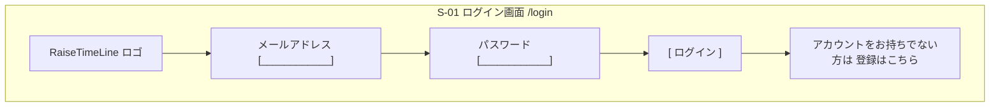
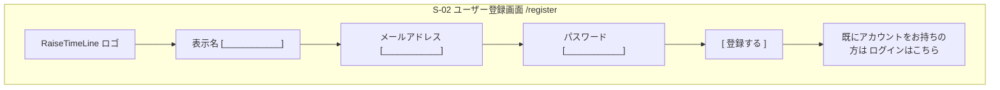
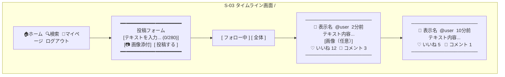
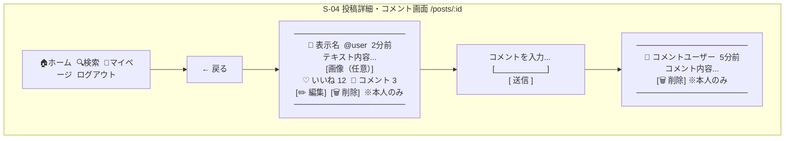
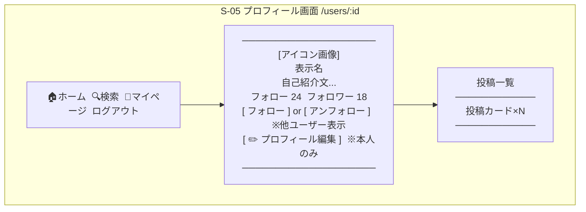
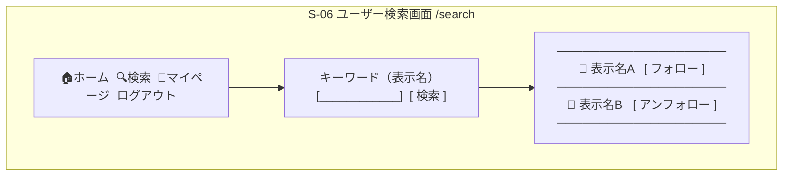

# ワイヤーフレーム

[← 要件定義書に戻る](../requirements.md)

---

## S-01 ログイン画面

```mermaid
flowchart TB
    subgraph S01["S-01 ログイン画面 /login"]
        A["RaiseTimeLine ロゴ"]
        B["メールアドレス [____________]"]
        C["パスワード       [____________]"]
        D["[ ログイン ]"]
        E["アカウントをお持ちでない方は 登録はこちら"]
        A --> B --> C --> D --> E
    end
```

---

## S-02 ユーザー登録画面

```mermaid
flowchart TB
    subgraph S02["S-02 ユーザー登録画面 /register"]
        A["RaiseTimeLine ロゴ"]
        B["表示名             [____________]"]
        C["メールアドレス [____________]"]
        D["パスワード       [____________]"]
        E["[ 登録する ]"]
        F["既にアカウントをお持ちの方は ログインはこちら"]
        A --> B --> C --> D --> E --> F
    end
```

---

## S-03 タイムライン画面

```mermaid
flowchart TB
    subgraph S03["S-03 タイムライン画面 /"]
        Nav["🏠ホーム  🔍検索  👤マイページ  ログアウト"]
        PostForm["━━━━━━━━━━━━━━━━━━━━━\n投稿フォーム\n[テキストを入力... (0/280)]\n[📷 画像添付]  [ 投稿する ]\n━━━━━━━━━━━━━━━━━━━━━"]
        Tabs["[ フォロー中 ]  [ 全体 ]"]
        Card1["────────────────────\n👤 表示名  @user  2分前\nテキスト内容...\n[画像（任意）]\n♡ いいね 12  💬 コメント 3\n────────────────────"]
        Card2["────────────────────\n👤 表示名  @user  10分前\nテキスト内容...\n♡ いいね 5   💬 コメント 1\n────────────────────"]
        Nav --> PostForm --> Tabs --> Card1 --> Card2
    end
```

---

## S-04 投稿詳細・コメント画面

```mermaid
flowchart TB
    subgraph S04["S-04 投稿詳細・コメント画面 /posts/:id"]
        Nav["🏠ホーム  🔍検索  👤マイページ  ログアウト"]
        Back["← 戻る"]
        Post["────────────────────\n👤 表示名  @user  2分前\nテキスト内容...\n[画像（任意）]\n♡ いいね 12  💬 コメント 3\n[✏️ 編集]  [🗑️ 削除]  ※本人のみ\n────────────────────"]
        CommentForm["コメントを入力... [____________]\n[ 送信 ]"]
        CommentList["────────────────────\n👤 コメントユーザー  5分前\nコメント内容...\n[🗑️ 削除] ※本人のみ\n────────────────────"]
        Nav --> Back --> Post --> CommentForm --> CommentList
    end
```

---

## S-05 プロフィール画面

```mermaid
flowchart TB
    subgraph S05["S-05 プロフィール画面 /users/:id"]
        Nav["🏠ホーム  🔍検索  👤マイページ  ログアウト"]
        Profile["────────────────────\n[アイコン画像]\n表示名\n自己紹介文...\nフォロー 24  フォロワー 18\n[ フォロー ] or [ アンフォロー ]  ※他ユーザー表示\n[ ✏️ プロフィール編集 ]  ※本人のみ\n────────────────────"]
        PostList["投稿一覧\n────────────\n投稿カード×N\n────────────"]
        Nav --> Profile --> PostList
    end
```

---

## S-06 ユーザー検索画面

```mermaid
flowchart TB
    subgraph S06["S-06 ユーザー検索画面 /search"]
        Nav["🏠ホーム  🔍検索  👤マイページ  ログアウト"]
        SearchForm["キーワード（表示名） [____________]  [ 検索 ]"]
        ResultList["────────────────────\n👤 表示名A   [ フォロー ]\n────────────────────\n👤 表示名B   [ アンフォロー ]\n────────────────────"]
        Nav --> SearchForm --> ResultList
    end
```
